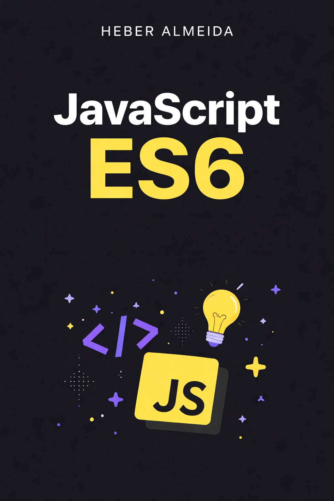

# ECMAScript 6 Tutorial | Tutorial ECMAScript 6

<p align="center">
  
</p>

## English

**ECMAScript 6 Tutorial** is a free, open-source guide to modern JavaScript. It covers the main syntax and features introduced in ES6 (ECMAScript 2015) and later versions, from `let` and `const` to modules, classes, Promises, Generators, and more.

The content is written in plain language with practical examples. It targets developers who already know ES5 and want to learn what’s new, and can also be used as a quick reference.

- **Demo:** [https://heberalmeida.github.io/TutorialES6/](https://heberalmeida.github.io/TutorialES6/)
- **Author:** Heber Almeida
- **Repository:** [https://github.com/heberalmeida/TutorialES6](https://github.com/heberalmeida/TutorialES6)

---

## Português

**Tutorial ECMAScript 6** é um guia gratuito e de código aberto sobre JavaScript moderno. Aborda as principais novidades de sintaxe do ES6 (ECMAScript 2015) e versões seguintes, incluindo `let` e `const`, módulos, classes, Promises, Generators e mais.

O conteúdo é didático e usa exemplos práticos. É indicado para quem já conhece ES5 e quer aprender o que mudou, e também serve como material de consulta.

- **Demo:** [https://heberalmeida.github.io/TutorialES6/](https://heberalmeida.github.io/TutorialES6/)
- **Autor:** Heber Almeida
- **Repositório:** [https://github.com/heberalmeida/TutorialES6](https://github.com/heberalmeida/TutorialES6)

---

## Features | Recursos

- **Vue 3** with Composition API
- **i18n** – English and Portuguese (Brazil)
- 32 chapters | 32 capítulos
- Dark theme | Tema escuro
- Responsive layout | Layout responsivo
- Language switcher | Troca de idioma

## Development | Desenvolvimento

```bash
npm install
npm run dev
```

## Build

```bash
npm run build
```

## Deploy (GitHub Pages)

1. Push to `main` or `master`
2. **Settings** → **Pages** → **Source**: **GitHub Actions**
3. The site is deployed on each push.
